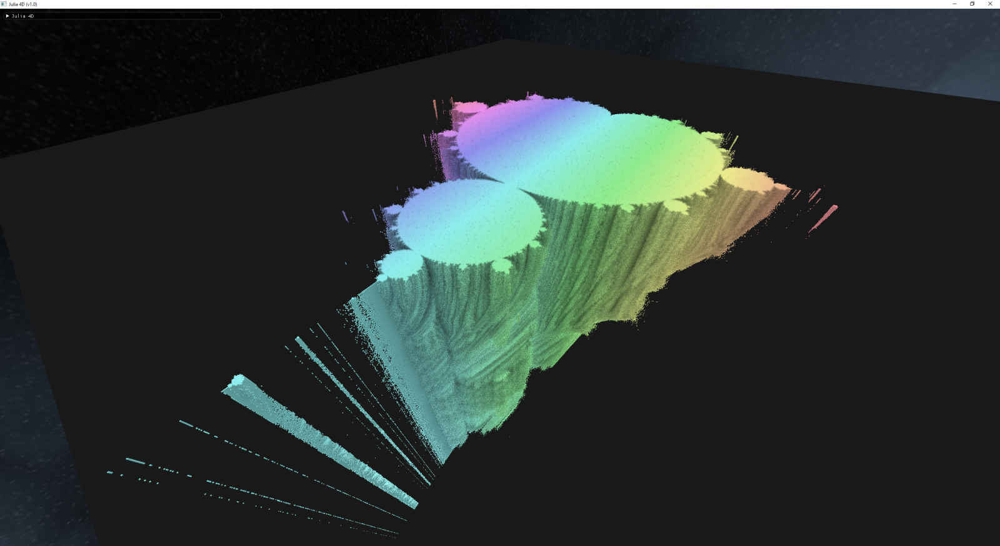
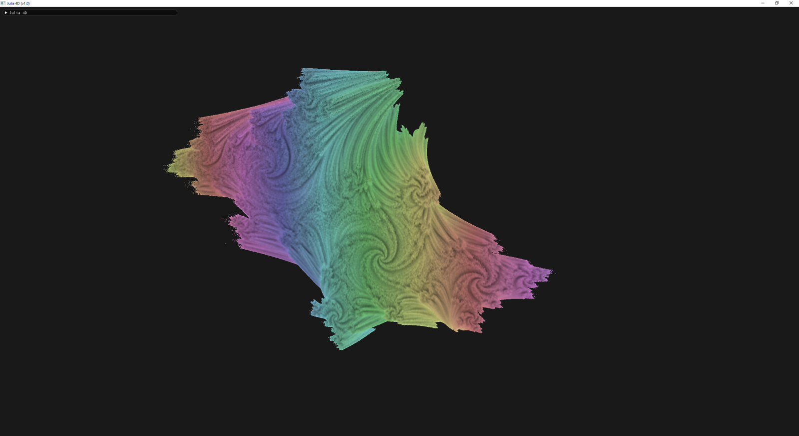
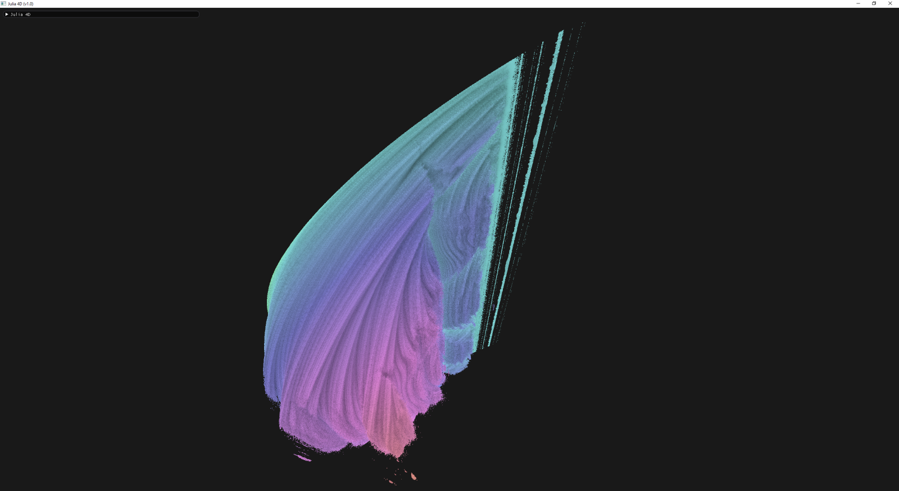

# Ray traced 4D Julia set

The Julia set is a 4D fractal, that is defined as the points where the `z(n) = z(n-1) + c` series is divergent.
As `n` and `c` are both complex numbers, they define the 4 dimensions of the set.

This app renders 3 arbitrary dimensions out of the 4. The 4th dimension can be manipulated trough a slider.

The mandelbrot set is actually a 2D slice of the 4D Julia set:

The usual 2D julia set images are also slices of the 4D geometry:

The set contains

## Requirements

The applications runs on Linux and Windows versions, where .net 6.0 is installed.

A GPU with OpenGL 4.5 drivers is required.
